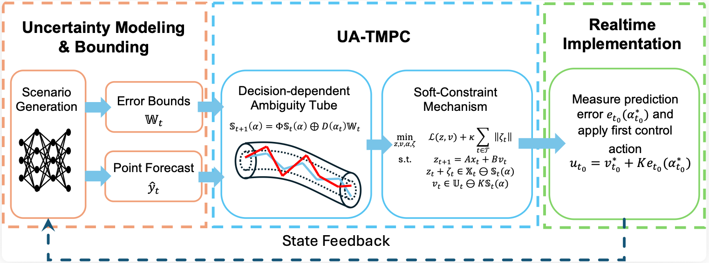

# Uncertainty-Allocation-Tube-MPC
This repository is the official implementation for the paper: **"Uncertainty Allocation-based Tube Model Predictive Control for Building Energy Management"**.

Authors: Qi Li, Wenbo Zeng, Xueyuan Cui, Yi Wang



This paper proposes a novel Uncertainty Allocation-based Tube MPC (UA-TMPC) framework. Departing from conventional static policies, we introduce a cost-aware active uncertainty allocation mechanism that treats allocation coefficients as decision variables, thereby dynamically directing forecasting errors towards the most cost-effective flexible resources. To address the resulting mathematical challenges of decision-dependent uncertainty, we construct adaptive ambiguity tubes that proactively adjust their geometry based on the allocation strategy. Furthermore, a soft-constrained formulation is integrated to mitigate the conservatism of hard tube bounds, enhancing solution feasibility without compromising system reliability.

# Environment
Python version: 3.13.7

The must-have packages can be installed by running
```bash
pip install -r requirements.txt
```
# Data
This project uses the data from multiple sources.
- **Download Link** You can download it from our google drive(https://drive.google.com/drive/folders/1EQyzTMvkdHomEoAbs5OwajAbKfOHnszL?usp=sharing)
- **Setup** After downloading, place all the files in the same directory as the code. The expected directory should be
```
your-repository/
├── UATMPC/
│   ├── optimizers/
│   │   ├── __init__.py
│   │   ├── dr_mpc.py
│   │   ├── ground_truth.py
│   │   ├── perfect_mpc.py
│   │   ├── robust_mpc.py
│   │   ├── scenario_mpc.py
│   │   ├── standard_mpc.py
│   │   ├── stochastic_tmpc.py
│   │   ├── tube_mpc.py
│   │   ├── ua_tube_mpc.py
│   ├── results/
│   ├── __init__.py
│   ├── ambiguity.py
│   ├── config.py
│   ├── data.py
│   ├── experiment.py
│   ├── forecasting.py
│   ├── scenarios.py
│   ├── single_day_test.ipynb
│   ├── one_month_test.ipynb
│   ├── daily_curve.ipynb
│   ├── ww_sensitivity.ipynb
│   ├── scenario_number_sensitivity.ipynb
│   ├── accuracy_sensitivity.ipynb
│   ├── reviewer_forecast_diagnostics.ipynb
├── building data/
│   └── 2zonesupermarket15.csv
├── 15temp_models/
│   └── *.model
├── 15pv_models/
│   └── *.model
├── 15load_models/
│   └── *.model
├── 23solar_data15.csv
├── United Kingdom.csv
├── requirements.txt
└── README.md
```

This repository includes Jupyter Notebooks for data exploration, model demonstration, and result analysis.

Python files
- **'__init__.py'**: Exposes the main configuration classes of the UATMPC package.
- **'config.py'**: Defines project paths, MPC settings, and physical system parameters.
- **'data.py'**: Loads and preprocesses weather, PV, building-load, and electricity-price data.
- **'forecasting.py'**: Loads XGBoost quantile-forecasting models and processes their predictions.
- **'scenarios.py'**: Generates uncertainty scenarios from quantile forecasts.
- **'ambiguity.py'**: Computes distributionally robust uncertainty bounds and ambiguity-set parameters.
- **'experiment.py'**: Coordinates data preparation, forecasting, optimization, and result collection.
  
MPC optimizers
- **'optimizers/__init__.py'**: Exports all implemented MPC optimizer classes.
- **'optimizers/standard_mpc.py'**: Implements deterministic MPC using point forecasts.
- **'optimizers/robust_mpc.py'**: Implements a robust MPC benchmark.
- **'optimizers/scenario_mpc.py'**: Implements scenario-based MPC using sampled uncertainty trajectories.
- **'optimizers/dr_mpc.py'**: Implements distributionally robust MPC with ambiguity-set constraints.
- **'optimizers/tube_mpc.py'**: Implements the tube-based MPC formulation.
- **'optimizers/ua_tube_mpc.py'**: Implements the proposed uncertainty-aware tube MPC method.
- **'optimizers/stochastic_tmpc.py'**: Implements distributionally robust tube MPC.
- **'optimizers/perfect_mpc.py'**: Implements MPC assuming perfect future forecasts.
- **'optimizers/ground_truth.py'**: Implements full-day optimization problem using ground-truth future data.

Jupyter notebooks

- **'single_day_test.ipynb'**: Runs and tests all MPC methods for one representative day.
- **'one_month_test.ipynb'**: Compares MPC methods over a one-month evaluation period.
- **'daily_curve.ipynb'**: Visualizes the daily temperature, energy, and control trajectories.
- **'ww_sensitivity.ipynb'**: Evaluates sensitivity to the soft-constraint penalty coefficient.
- **'accuracy_sensitivity.ipynb'**: Evaluates sensitivity to the uncertainty scaling factor.
- **'reviewer_forecast_diagnostics.ipynb'**: Examines forecast calibration and scenario-generation quality.


